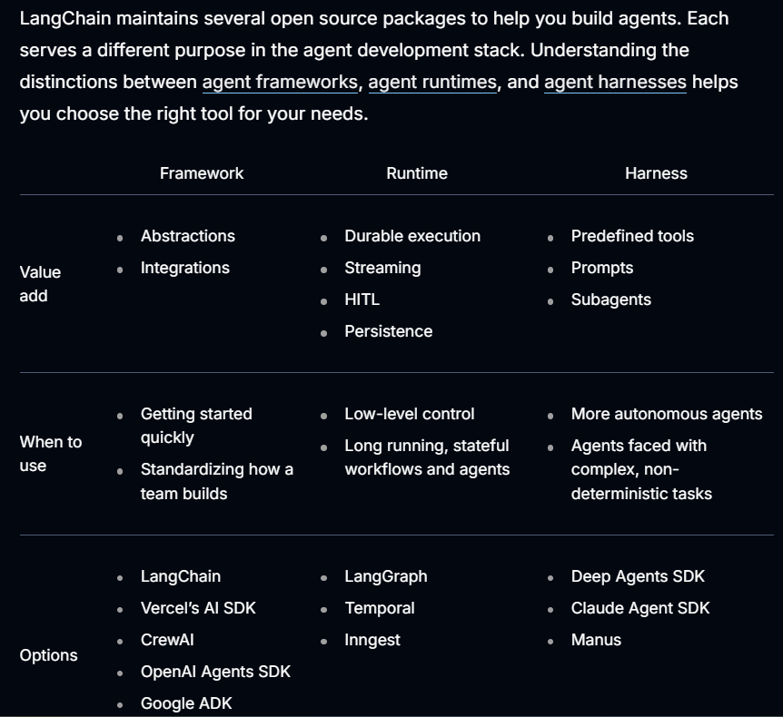
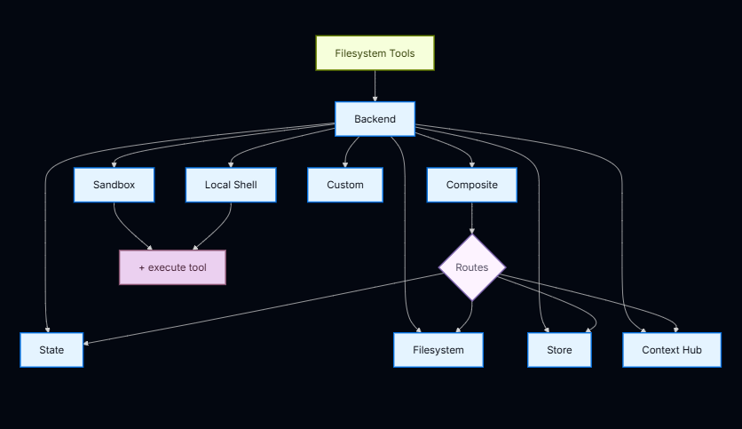
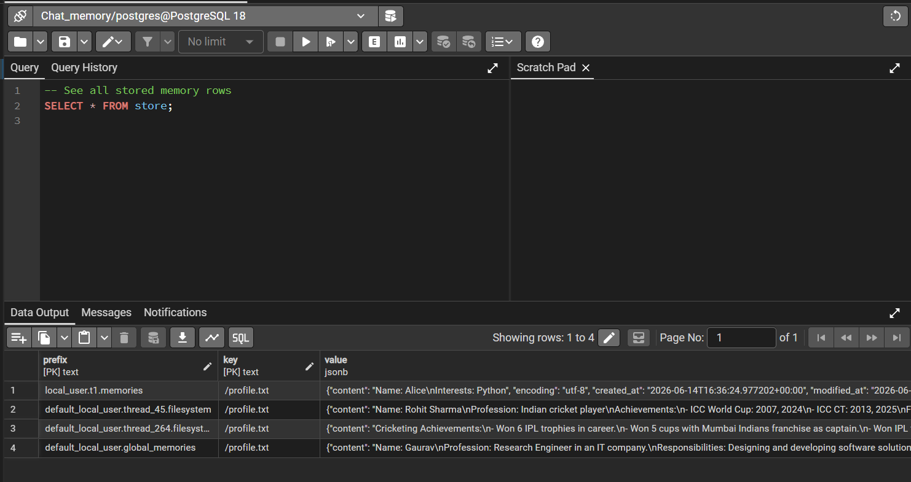
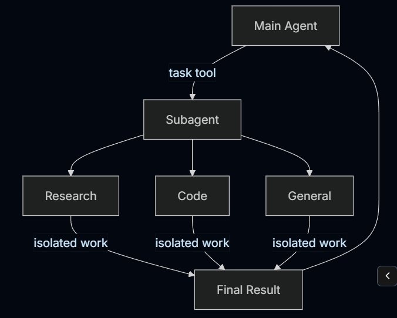
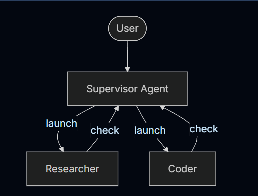
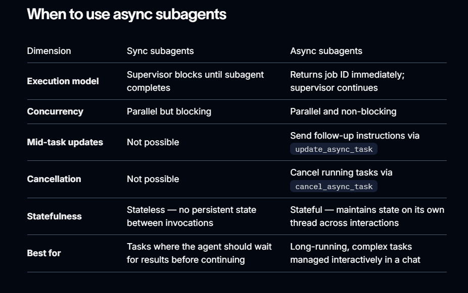
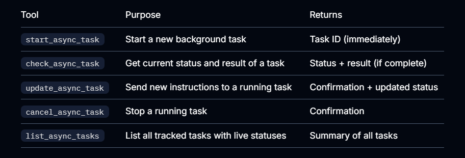
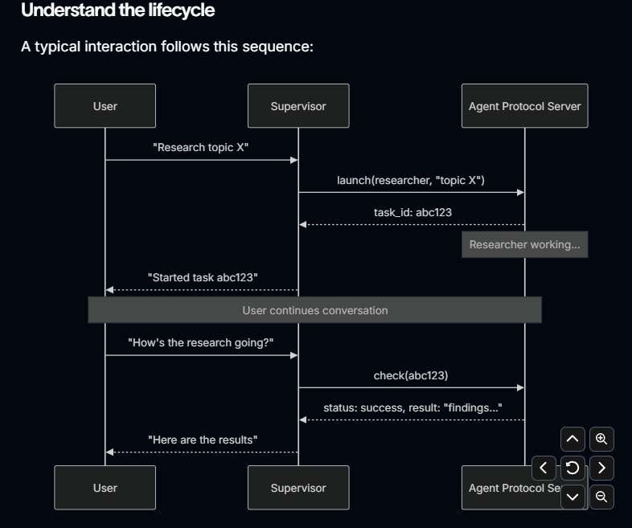

# DeepAgents
DeepAgents core understandings and developement of advanced ai agents. With memory, skill, tools, subagents, multiagents flow etc.


## Project setup and start:
1. ``` uv init deepagents``` //Initialize the Project
2. ``` cd deepagents```
3. ``` uv venv```  // Lock and Setup the Environment
4. ``` uv run main.py``` //run the project (optional - make sure correct setup is done)

- Now, from the correct path: 
5. Create a requirements.txt file with correct module and other requirements.
6. ```uv add -r requirements.txt``` //migrate the requirements.
7. ``` uv pip install -r requirements.txt``` //install the dependencies and required modules/lib.
 
----------
## Deep agent selection over langchain and langgraph or other frameworks/sdk



-----------
## Deep agent Filesystem Tools - Backend



---
## Deep agent backend configured with postgres DB - 
### For CompositeStore and StoreBackend : to maintain chat history and memory across different threads in persistence manner.



---- 
## Deepagent Subagents:

A deep agent can create subagents to delegate work. You can specify custom subagents in the subagents parameter. Subagents are useful for context quarantine (keeping the main agent’s context clean) and for providing specialized instructions.

### Why use Subagents?
Subagents solve the context bloat problem. When agents use tools with large outputs (web search, file reads, database queries), the context window fills up quickly with intermediate results. Subagents isolate this detailed work—the main agent receives only the final result, not the dozens of tool calls that produced it.

### 1. Synchronous Subagent->


### 2. Async Subagents ->
- Async subagents let a supervisor agent launch background tasks that return immediately, so the supervisor can continue interacting with the user while subagents work concurrently. The supervisor can check progress, send follow-up instructions, or cancel tasks at any point.

- Use async subagents when tasks are long-running, parallelizable, or need mid-flight steering.



---- 

## When to Use Async Subagent vs Sync Agent / Subagent: 


- The AsyncSubAgentMiddleware which is included in the default middleware stack when async subagents are configured, gives the supervisor five tools:


- The supervisor’s LLM calls these tools like any other tool. The middleware handles thread creation, run management, and state persistence automatically.

### Understand the lifecycle of Async Subagent:


---